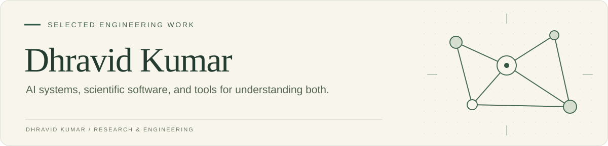

I build and evaluate software across **GPU systems, developer tools, and medical imaging**. My work connects research experiments with interfaces, infrastructure, and evidence that people can inspect and use.

[LinkedIn](https://www.linkedin.com/in/dhravid) · [Email](mailto:dhravid@umich.edu)

### Explore the work

| Project | Engineering focus | Start here |
| :--- | :--- | :--- |
| **TraceForge** | Coding-agent trajectory analysis, evidence graphs, and a Jac/Python CLI | [Project & sample workflow](https://github.com/Dhravidk/TraceForge) |
| **openTorch / CGinS** | PyTorch operator profiling, CUDA generation, and correctness feedback | [Architecture & source](https://github.com/Dhravidk/openTorch) |
| **Coding-Agent Research Library** | Literature discovery, source provenance, and thematic research indexes | [Browse the library](https://github.com/Dhravidk/Coding-Agents) |
| **Medical Physics Residency Site** | Structured content, program navigation, and a Next.js interface | [Application source](https://github.com/Dhravidk/amma) |

### What connects my work

**Measure carefully.** Preserve the workload, baseline, and evaluation context behind a result.  
**Make failures inspectable.** Build tools that explain what happened and retain the evidence.  
**Finish the workflow.** Connect models and experiments to usable interfaces and reproducible execution.

My broader research includes **distributed model serving**, **coding-agent evaluation**, and **medical-image segmentation and source localization**. These public repositories cover selected parts of that work.

Interested in research engineering, developer infrastructure, and systems software.
