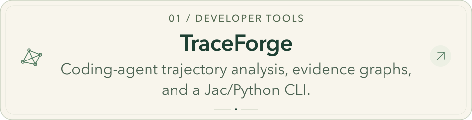
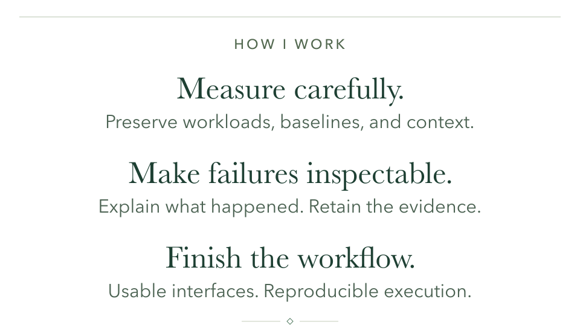

  

    
  

  

    
    
  

  

  

    
  

  

    
  

  

    
  

  

    
  

  

  

    
More about my research

    
My broader research includes distributed model serving, coding-agent evaluation, and medical-image segmentation and source localization. These public repositories cover selected parts of that work.

    
Interested in research engineering, developer infrastructure, and systems software.

  

